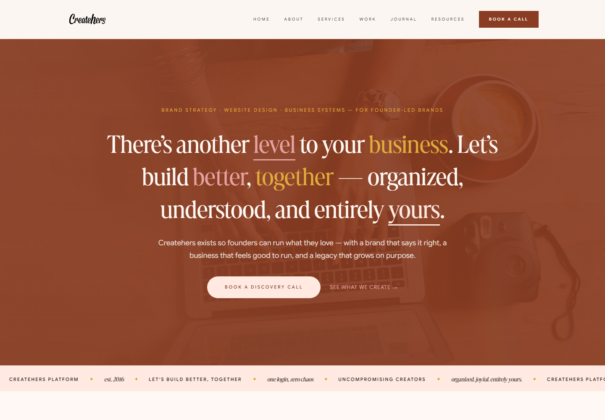
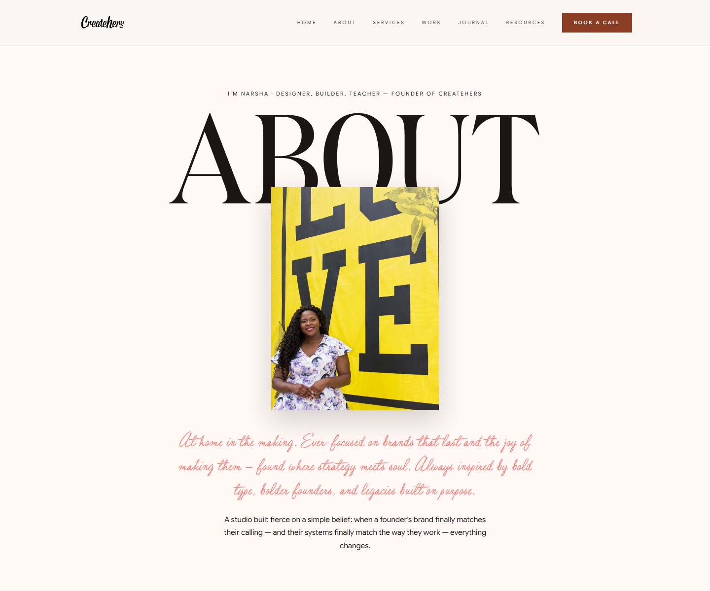
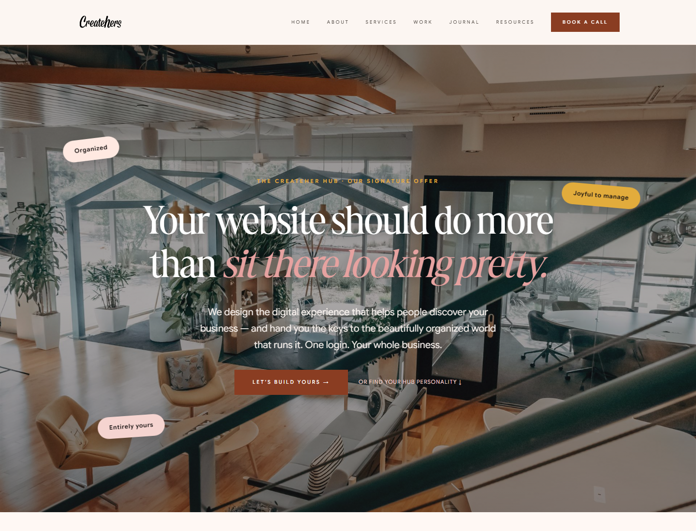
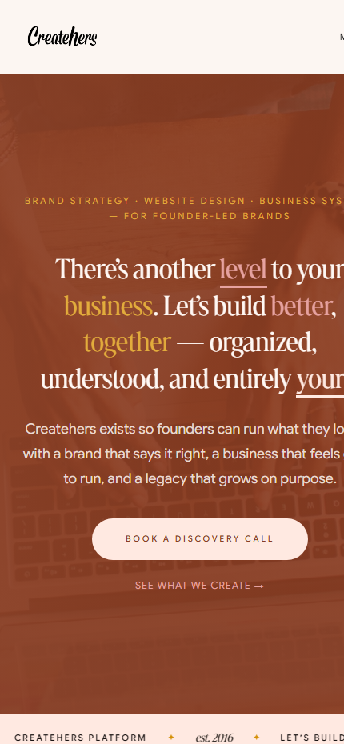
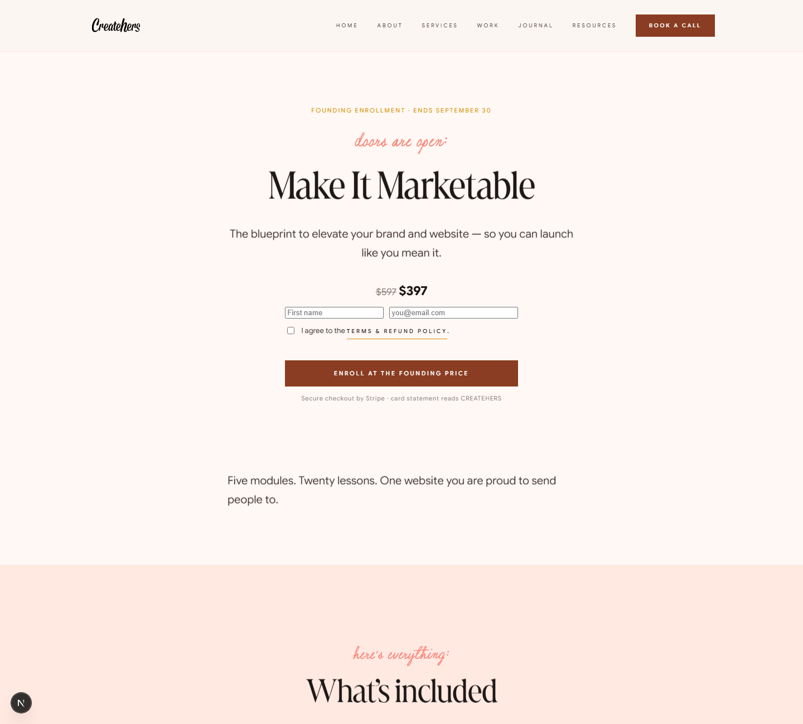
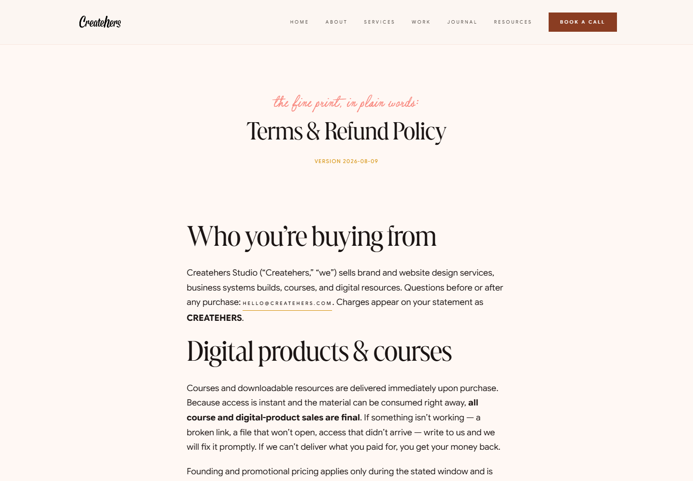
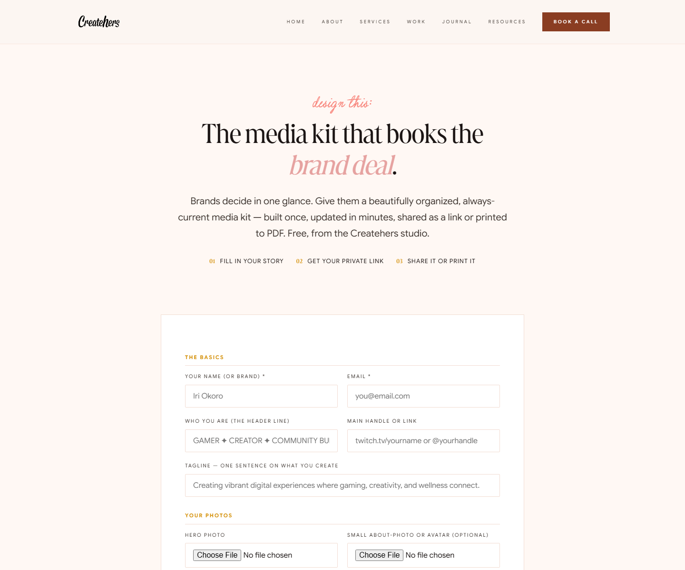
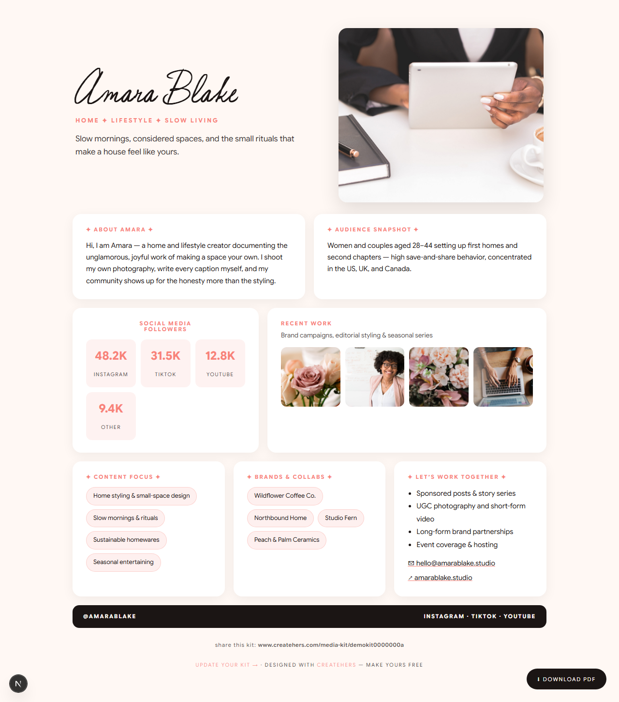
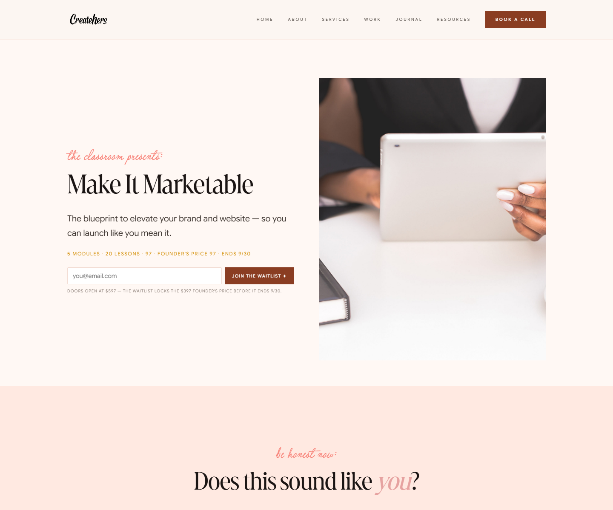
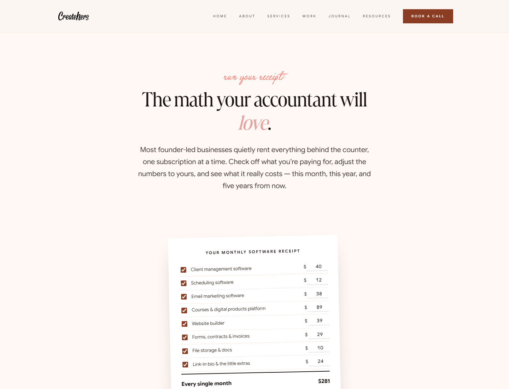

# Createhers Platform — Design Engineering Case Study

**Live:** [createhers.com](https://www.createhers.com)

A production platform I designed and engineered end to end: the public
business, the products it sells, and the internal system that runs both.

---

## Overview

Createhers is a design studio. Like most small studios, its work was spread
across a marketing site it didn't control, a scheduling tool, a mailing-list
tool, a course host, a payments dashboard, and a spreadsheet holding the
parts nothing else covered. Every new offer meant another subscription and
another place to check.

I designed and built a single platform to replace that: one product where
the public storefront and the operations behind it share a database, a
design system, and a point of view. The site sells the work; the system
runs the work. It is deployed, serving real traffic, and it is the studio's
day-to-day operations software.

This repository is the case study. **The application source is private** —
see [Confidentiality](#confidentiality).

---

## My role

Sole designer and engineer. I owned:

- Product strategy and offer architecture
- Information architecture and journey design
- Brand identity, art direction, and all written copy
- Interface design and the design system
- Frontend implementation
- Application and data architecture
- Third-party integrations (payments, email, calendar)
- Accessibility and responsive behavior
- Testing, deployment, and post-launch iteration based on real use

The platform is maintained by the same person who designed it, which is why
the operational decisions and the design decisions agree with each other.

---

## The product

**Public surfaces**

| Surface | What it does |
|---|---|
| Marketing site | Services, portfolio, journal, about — the studio's storefront |
| Commerce | Product pages and checkout for services, courses, and digital products |
| Classroom | Course landings, curriculum, enrollment, and a lesson player with progress |
| Resources | Gated downloads and interactive lead tools |
| Creator tool | A free tool that generates shareable one-page media kits |
| Authored pages | Standalone offer pages published without a code change |

**Operations**

Behind authentication: client and project records, scheduling with real
availability, inquiry pipelines, audience management, campaign email,
product and order management, and content management for everything the
public site renders.

**Scale of the surface area:** two audiences (visitors and the operator),
six public product surfaces, an authenticated operations area, three
external integrations, and a content model that lets non-developers publish
without touching code.

---

## Product challenges

**One ecosystem, two very different users.** A visitor deciding whether to
hire a studio and an operator running that studio need opposite things: one
wants persuasion and atmosphere, the other wants density and speed. Both
live in one codebase and one design system. The resolution was a shared
foundation — type scale, color tokens, spacing, form patterns — expressed
differently on each side rather than two disconnected products.

**Several entry points without fragmenting the product.** Visitors arrive
ready to hire, ready to learn, ready to buy something small, or not ready
at all. Each needed a legible path that didn't make the others feel like
clutter. This became a deliberate offer ladder in the information
architecture: every page states one primary action, with lower-commitment
paths available but subordinate.

**Complex business workflows made administrable.** Booking, enrollment,
fulfillment, and audience segmentation are genuinely stateful processes.
The design goal was that the operator never needs to remember a process —
the interface has to carry it, surfacing what needs attention and hiding
what doesn't.

**Publishing without deploying.** Early on, adding an offer meant editing
code. That was a design failure, not just an inconvenience. Content,
products, and full landing pages are now authored in the admin interface
and rendered from data, so the business can move without engineering.

**Expressive brand, still usable.** The studio's identity is editorial and
typographic — large display type, script accents, generous space. Holding
that voice while meeting contrast, focus, and reading-order requirements
was a constant negotiation, and it shaped the type scale and color tokens
more than any aesthetic preference did.

---

## Design engineering approach

Working across both sides changed how the product got built.

**Interaction models before screens.** Complex flows were specified as
states and transitions — including empty, loading, partial, error, and
recovery — before any layout work. Designing the unhappy paths first meant
the interface didn't need retrofitting once real data arrived.

**Components earned, not invented.** Patterns were extracted when a third
instance appeared, not anticipated up front. The result is a small
vocabulary reused heavily rather than a large library used once.

**Data-shaped interfaces.** Because I designed the data model as well as
the screens, the interface reflects how the information is actually
structured — which is why the operations views can stay dense without
feeling arbitrary.

**Progressive enhancement as a design constraint.** Forms and navigation
work without client-side JavaScript. Interactivity is added where it earns
its weight, which keeps pages fast and behavior predictable.

**Accessibility treated as design work.** Semantic structure, visible focus
states, keyboard operability, honored reduced-motion preferences, and
contrast decisions recorded alongside the color tokens rather than audited
afterward.

**Iteration against real use.** The studio uses this software daily, so
friction surfaces immediately and gets designed out — a feedback loop most
portfolio work never gets.

---

## Selected experiences

### The marketing site

**Problem.** A studio site has to establish taste in the first screen while
still routing four different kinds of visitor.

**Decision.** A typographic hero carrying the positioning statement, then a
narrative sequence — the promise, the offer ladder, proof, the method, then
the ask. Each section has one job and one action.

**Outcome.** Visitors self-select into the right path early, and the page
does qualifying work that used to happen on introductory calls.

Editorial layout system, self-hosted typography, and a token-driven color
system. Fully responsive:

### Commerce

**Problem.** Every launch previously required building a page, which meant
the business moved at the speed of deployment.

**Decision.** A sales-page template driven by structured content, authored
in the admin interface — hero, narrative, inclusions, proof, FAQ, and a
purchase action — with the commerce component embeddable anywhere in the
product.

**Outcome.** A new offer goes live in minutes without a code change, and
every offer page inherits the same design and accessibility decisions.

Purchase terms and policy are treated as product design, not an afterthought
bolted on at checkout.

### The creator tool

**Problem.** The studio's audience needed a professional one-page media kit
and mostly did not have design software or a designer.

**Decision.** A guided builder with an editable palette, flexible audience
figures, image uploads, and a work gallery — producing a finished document
the creator owns and shares.

**Outcome.** A genuinely useful free tool that introduces new people to the
studio, and finished kits render standalone — outside the host site's
layout — because the artifact belongs to the creator, not to the studio.

*Sample kit — fictional creator, illustrative figures.*

### Learning and lead tools

Course landings, curriculum, enrollment, and a lesson player with progress
tracking — designed so a self-paced learner always knows where they are and
what comes next.

An interactive calculator that makes an abstract cost concrete, then offers
a useful takeaway. A lead tool that gives something real before asking for
anything.

### The operations system

Behind authentication is the software the studio runs on: records,
scheduling, pipelines, audience, campaigns, commerce, and content
management.

It isn't pictured here, and its structure isn't documented here. That
system is the product, and its design is the thinking the studio sells.
Private walkthroughs can be arranged during hiring conversations.

---

## Design system

**Typography.** A display serif for editorial moments, a humanist sans for
interface and reading, and a script for accents — all self-hosted, on a
fixed type scale. Display sizing is fluid across breakpoints so headlines
hold their proportions.

**Color.** Tokens rather than values: surfaces, ink, accent, and semantic
states. A palette change happens in one place and propagates. Contrast
pairings are documented alongside the tokens, including which combinations
are approved for small text.

**Layout.** A small set of section rhythms — full-bleed statement, split,
grid, ticker — composed rather than reinvented per page. Spacing follows a
consistent scale.

**Components.** Forms, cards, chips, tables, list rows, badges, modals, and
media blocks, each with defined states. Interface components share structure
with marketing components rather than living in a separate world.

**Responsive principles.** Layout adapts at structural breakpoints rather
than scaling proportionally; wide content scrolls within its own container
so the page never scrolls sideways; touch targets and reading measure are
respected at small sizes.

**Accessibility.** Semantic landmarks and heading order, visible focus
states, keyboard-operable interactive components, `prefers-reduced-motion`
honored throughout, and alternative text treated as content.

**Print.** Documents produced by the platform carry their own print
treatment, and generated PDFs are composed programmatically for delivery.

---

## Technical overview

Next.js and React with server-rendered application experiences, relational
persistence, authenticated operations, payment and email integrations, a
read-only external calendar integration, and automated deployment to a
managed container host.

The build is deliberately dependency-light — no ORM, no component library,
no CSS framework, no vendor SDKs — which keeps the surface area small
enough for one person to own and reason about.

Implementation specifics, security mechanisms, data architecture, and
operational workflows are intentionally not documented here.

---

## What I learned

**Designing for your own operations is a different discipline.** When you
also run the business, you can't hide behind an idealized user. Every
workflow you design badly becomes your Tuesday. It made me far more honest
about which features were real needs versus interesting ideas.

**Reducing steps beats adding features.** The most valuable work was
consistently removing a step, a decision, or a place to look — not adding
capability. The version of a screen that finally worked was almost always
the one with less on it.

**Systems, not screens.** Designing the data model alongside the interface
produced better outcomes than designing screens and fitting data behind
them. It also made later features cheap, because the structure already
anticipated them.

**Implementation decisions are UX decisions.** Choosing server-rendered
forms over client-side state, or content-driven pages over hardcoded ones,
changed what the product could do and how it felt. Those trade-offs get made
well only when the same person understands both sides.

**Shipping changes the design conversation.** Running the thing daily
surfaces friction no critique session would have caught, and it kept the
work honest — the roadmap came from use, not from speculation.

---

## Confidentiality

Certain application architecture, operational workflows, security
implementations, business logic, and source code are intentionally omitted
because they represent proprietary Createhers intellectual property. Private
technical walkthroughs can be provided during appropriate hiring
conversations.

---

## Contact

**Narsha Njoya** — Atlanta, GA
[createhers.com](https://www.createhers.com) ·
[linkedin.com/in/narsha](https://linkedin.com/in/narsha)

Available for senior product design, design engineering, and fractional
engagements.
